# CopyX - Privacy-Preserving Copy Trading Architecture

## Current Implementation
**Privacy-preserving swaps with encrypted intent batching**

```mermaid
%%{init: {'theme':'dark', 'themeVariables': { 'primaryColor':'#03dac6', 'primaryTextColor':'#fff', 'primaryBorderColor':'#00a896', 'lineColor':'#03dac6', 'secondaryColor':'#bb86fc', 'tertiaryColor':'#3700b3', 'background':'#121212', 'mainBkg':'#1f1f1f', 'secondBkg':'#2d2d2d', 'tertiaryBkg':'#3d3d3d', 'textColor':'#ffffff', 'labelBackground':'#2d2d2d', 'labelTextColor':'#ffffff', 'actorBkg':'#424242', 'actorBorder':'#03dac6', 'actorTextColor':'#fff', 'signalColor':'#03dac6', 'signalTextColor':'#fff'}}}%%
sequenceDiagram
    participant Users as Multiple Users
    participant Frontend as Frontend
    participant Hook as Privacy Hook
    participant ZAMA as ZAMA FHEVM
    participant AVS as AVS Operators
    participant SwapManager
    participant Pool as Uniswap V4

    rect rgb(30, 60, 80)
        Note over Users,Hook: PHASE 1: Deposit & Token Creation
        Users->>Hook: Deposit USDC/USDT
        Hook->>Hook: Update poolReserves
        Hook->>ZAMA: Create encrypted tokens
        ZAMA->>Hook: Deploy eUSDC/eUSDT contracts
        Hook->>Users: Mint encrypted tokens
    end

    rect rgb(60, 80, 40)
        Note over Users,Hook: PHASE 2: Intent Collection (5 blocks)
        Users->>ZAMA: Encrypt swap amounts locally
        Users->>Hook: submitIntent(encAmount, tokenIn, tokenOut)
        Hook->>Hook: Transfer eTokens as collateral
        Hook->>Hook: Add to current batch

        alt Batch interval reached (5 blocks)
            Hook->>Hook: Auto-finalize previous batch
            Hook->>SwapManager: Submit batch to AVS
        end
    end

    rect rgb(40, 80, 60)
        Note over AVS,SwapManager: PHASE 3: AVS Processing (Off-chain)
        SwapManager->>AVS: Batch of encrypted intents

        AVS->>ZAMA: Batch decrypt all intents
        Note over AVS: Example batch:<br/>U1: 12k eUSDC→eUSDT<br/>U2: 7.5k eUSDT→eUSDC<br/>U3: 4k eUSDC→eUSDT<br/>U4: 1.2k eUSDT→eUSDC

        AVS->>AVS: Match opposite intents
        Note over AVS: Internal matching:<br/>U1↔U2: 7.5k<br/>U3↔U4: 1.2k<br/>Net: 7.3k USDC→USDT

        AVS->>AVS: Calculate net swap needed
    end

    rect rgb(60, 40, 80)
        Note over AVS,Pool: PHASE 4: Settlement
        AVS->>Hook: settleBatch(internalTransfers, netSwap, distributions)

        par Internal Transfers (Encrypted)
            Hook->>ZAMA: burnEncrypted(from, amount)
            Hook->>ZAMA: mintEncrypted(to, amount)
            Note over Hook: 8.7k matched internally<br/>(no AMM needed)
        and Net AMM Swap (Public)
            Hook->>Pool: unlock() for callback
            Pool->>Hook: unlockCallback()
            Hook->>Pool: swap(7.3k USDC→USDT)
            Pool->>Hook: Return USDT
            Note over Pool: Only 7.3k visible on-chain<br/>(aggregated amount)
        end

        Hook->>Users: Distribute encrypted outputs
        Note over Users: U1: 12k eUSDT<br/>U2: 7.5k eUSDC<br/>U3: 4k eUSDT<br/>U4: 1.2k eUSDC
    end

    rect rgb(30, 80, 50)
        Note over Users,Pool: BENEFITS:<br/>✅ 45% reduction in AMM usage<br/>✅ Complete privacy via batching<br/>✅ Gas optimization<br/>✅ Pyth Entropy for fair operator selection
    end
```

---

## Complete Fund Management Architecture
**Advanced DeFi Integration with Copy Trading**

```mermaid
%%{init: {'theme':'dark', 'themeVariables': { 'primaryColor':'#bb86fc', 'primaryTextColor':'#fff', 'primaryBorderColor':'#6200ea', 'lineColor':'#03dac6', 'secondaryColor':'#cf6679', 'tertiaryColor':'#018786', 'background':'#121212', 'mainBkg':'#1f1f1f', 'secondBkg':'#2d2d2d', 'tertiaryBkg':'#3d3d3d', 'textColor':'#ffffff', 'labelBackground':'#2d2d2d', 'labelTextColor':'#ffffff', 'actorBkg':'#424242', 'actorBorder':'#bb86fc', 'actorTextColor':'#fff', 'signalColor':'#03dac6', 'signalTextColor':'#fff'}}}%%
sequenceDiagram
    participant Traders as Alpha Traders
    participant Subscribers as Copy Trade<br/>Subscribers
    participant Hook as Privacy Hook<br/>(Vault Manager)
    participant ZAMA as ZAMA FHEVM
    participant AVS as AVS Validators
    participant MerkleVerifier as Merkle<br/>Verifier
    participant IntentManager as Intent Manager
    participant DeFi as DeFi Protocols<br/>(Aave, Compound)
    participant Pool as Uniswap V4

    rect rgb(40, 60, 80)
        Note over Traders,Hook: LIQUIDITY & INTENT SUBMISSION

        alt New Liquidity Provider
            Traders->>Hook: Add liquidity
            Hook->>Hook: Split: 20% to Pool, 80% retained
            Hook->>Pool: beforeAddLiquidity(20% only)
            Hook->>Hook: Mark 80% for DeFi deployment
        else Trading Intent
            Traders->>ZAMA: Encrypt complete trade strategy
            Note over ZAMA: Strategy includes:<br/>- Entry/exit prices<br/>- DeFi deployments<br/>- Risk parameters
            Traders->>Hook: Submit encrypted intent
        end
    end

    rect rgb(60, 40, 80)
        Note over AVS,IntentManager: AVS VALIDATION & MERKLE VERIFICATION

        Hook->>IntentManager: Forward encrypted batch
        IntentManager->>AVS: Request validation

        AVS->>ZAMA: Decrypt trade strategies
        AVS->>AVS: Simulate trades for profitability
        Note over AVS: Check:<br/>- Expected returns > threshold<br/>- Risk within limits<br/>- No sandwich attacks

        alt Trade is Profitable
            AVS->>AVS: Generate sanitized call data
            Note over AVS: Leaf = {target, selector, args}<br/>Example: supply(USDC, 10000e6, vault, 0)
            AVS->>MerkleVerifier: Create Merkle proof
            AVS->>IntentManager: Submit verified trade
        else Trade Unprofitable
            AVS->>IntentManager: Reject intent
            IntentManager->>Hook: Return collateral
        end
    end

    rect rgb(40, 80, 60)
        Note over IntentManager,DeFi: EXECUTION WITH MERKLE VERIFICATION

        IntentManager->>MerkleVerifier: Verify trade proof
        MerkleVerifier->>MerkleVerifier: Check against root

        alt Valid Merkle Proof
            IntentManager->>Hook: Execute verified trade

            par DeFi Deployment (80% funds)
                Hook->>DeFi: Deploy to Aave/Compound
                DeFi->>Hook: Return yield tokens
                Note over DeFi: Generating extra yield<br/>on idle liquidity
            and Trading Execution
                Hook->>Pool: Execute swaps
                Pool->>Hook: Return output
            end

            Hook->>ZAMA: Encrypt results
            Hook->>Traders: Distribute encrypted profits
        else Invalid Proof
            IntentManager->>Hook: Revert transaction
        end
    end

    rect rgb(80, 40, 60)
        Note over Subscribers,Hook: COPY TRADING FEATURE

        Subscribers->>Hook: Subscribe to trader
        Hook->>Hook: Register subscription

        loop On Profitable Trade Execution
            Hook->>AVS: Check if trade was profitable
            alt Trade Profitable
                Hook->>ZAMA: Encrypt trade parameters
                Hook->>Subscribers: Replicate trade proportionally
                Note over Subscribers: Automatic execution<br/>with subscriber's funds
            end
        end
    end

    rect rgb(40, 60, 60)
        Note over Hook,DeFi: RISK MANAGEMENT

        Hook->>Hook: Monitor pool utilization
        alt Low Utilization
            Hook->>DeFi: Deploy more to DeFi (up to 80%)
        else High Utilization
            Hook->>DeFi: Withdraw from protocols
            DeFi->>Hook: Return funds + yield
            Hook->>Pool: Increase AMM liquidity
        end
    end

    rect rgb(30, 50, 70)
        Note over Traders,Pool: KEY FEATURES:<br/>✅ 80% capital efficiency via DeFi<br/>✅ Merkle-verified safe trades only<br/>✅ Copy trading for retail users<br/>✅ Complete end-to-end encryption<br/>✅ Dynamic liquidity management
    end
```

## Technical Stack

- **Smart Contracts**: Solidity with Uniswap V4 hooks
- **FHE**: ZAMA FHEVM for encrypted computations
- **AVS**: EigenLayer for decentralized operators
- **Randomness**: Pyth Entropy for fair selection
- **Oracles**: Pyth Price Feeds for USD accounting
- **Frontend**: React + ZAMA SDK
- **DeFi Integration**: Aave, Compound (extensible)