# CopyX - Privacy-Preserving Copy Trading Platform

CopyX is a revolutionary decentralized copy trading platform that leverages Fully Homomorphic Encryption (FHE) to enable privacy-preserving trade execution on Ethereum. Built on EigenLayer's AVS infrastructure, it combines encrypted intent processing with automated market making through Uniswap V4 hooks.

## 🏗️ Architecture Overview

> For detailed sequence diagrams, see [Architecture Diagrams](./ethindia_architecture_diagrams.md)

CopyX consists of three main components working in harmony:

### 1. **Universal Privacy Hook (Uniswap V4)**
- Custom hook that intercepts swap operations
- Batches encrypted trading intents using FHE
- Manages liquidity pools with 80/20 vault allocation strategy
- Enables privacy-preserving order matching without revealing trade details

### 2. **SwapManager AVS (EigenLayer)**
- Decentralized operator network for processing encrypted intents
- Uses **Pyth Entropy** for verifiable randomness in operator selection
- Implements Universal Encrypted Intent (UEI) framework
- Consensus-based settlement with multi-operator attestation

### 3. **SimpleBoringVault**
- Strategy execution vault with **Pyth Price Oracle** integration
- USD-based accounting system (not token-based)
- Real-time price feeds for accurate portfolio valuation
- Manages 80% of liquidity for copy trading strategies

## 🔐 Key Technologies

### **Fully Homomorphic Encryption (FHE)**
- **@zama-ai/fhevm**: Enables computation on encrypted data
- Trade amounts and parameters remain encrypted throughout execution
- Zero-knowledge privacy for all trading activities

### **Pyth Network Integration**
- **Pyth Entropy**: Provides verifiable randomness for fair operator selection
  - Replaces predictable block hash randomness
  - Ensures unbiased, manipulation-resistant operator committee formation
  - Asynchronous callback mechanism for true randomness

- **Pyth Price Oracles**: Real-time price feeds for USD-based accounting
  - Accurate portfolio valuation across multiple tokens
  - Protection against price manipulation
  - Sub-second price updates with confidence intervals

### **Uniswap V4 Hooks**
- Custom `UniversalPrivacyHook` for encrypted swap processing
- Batch settlement mechanism for gas efficiency
- Internal balance tracking for reduced on-chain transactions
- Seamless integration with existing Uniswap V4 liquidity

### **EigenLayer AVS**
- Decentralized operator network with stake-based security
- ECDSA-based consensus mechanism
- Slashable security guarantees
- Restaked ETH for enhanced economic security

## 🚀 Features

- **Privacy-First Trading**: All trade details remain encrypted
- **Copy Trading**: Follow successful traders without revealing strategies
- **Fair Operator Selection**: Pyth Entropy ensures unbiased randomness
- **USD-Based Accounting**: Accurate portfolio tracking with Pyth oracles
- **Batch Processing**: Gas-efficient settlement of multiple trades
- **Decentralized Execution**: No single point of failure or control

## 📋 Requirements

- Node.js v18+
- Hardhat
- MetaMask browser extension
- Foundry (for contract development)

## 🛠️ Installation

```bash
# Clone the repository
git clone https://github.com/consentsam/CopyX.git
cd CopyX

# Install dependencies
npm install

# Install Pyth SDK
npm install @pythnetwork/pyth-sdk-solidity
npm install @pythnetwork/entropy-sdk-solidity
```

## 🔧 Configuration

### Local Development

1. **Start Hardhat Node**:
```bash
npm run hardhat-node
```

2. **Deploy Contracts**:
```bash
npm run deploy:local
```

3. **Configure MetaMask**:
- Network Name: Hardhat
- RPC URL: http://127.0.0.1:8545
- Chain ID: 31337
- Currency: ETH

### Testnet Deployment (Sepolia)

1. **Set Environment Variables**:
```bash
cp .env.example .env
# Add your MNEMONIC, INFURA_API_KEY, PYTH_ENDPOINT
```

2. **Deploy to Sepolia**:
```bash
npm run deploy:sepolia
```

## 📁 Project Structure

```
CopyX/
├── packages/
│   ├── hello-world-avs/       # AVS and smart contracts
│   │   ├── contracts/
│   │   │   ├── SwapManager.sol      # AVS with Pyth Entropy
│   │   │   ├── SimpleBoringVault.sol # Vault with Pyth Oracles
│   │   │   └── UniversalPrivacyHook.sol
│   │   └── scripts/
│   ├── fhevm-hardhat-template/ # FHE contract templates
│   └── site/                    # React frontend
│       ├── fhevm/              # FHE integration hooks
│       └── hooks/              # React hooks for contract interaction
```

## 🔑 Smart Contract Addresses

### Mainnet (Coming Soon)
- SwapManager AVS: `TBD`
- UniversalPrivacyHook: `TBD`
- SimpleBoringVault: `TBD`

### Sepolia Testnet
- SwapManager AVS: `0x...`
- Pyth Entropy: `0x41c9e39574F40Ad34c79f1C99B66A45eFB830d4c`
- Pyth Oracle: `0x694AA1769357215DE4FAC081bf1f309aDC325306`

## 🧪 Testing

```bash
# Run unit tests
npm test

# Run integration tests
npm run test:integration

# Test with coverage
npm run coverage
```

## 📊 How It Works

### Process Flow

1. **User submits encrypted trade intent** → FHE ensures privacy
2. **Hook batches intents** → Reduces gas costs
3. **Pyth Entropy selects operators** → Fair, random selection
4. **Operators decrypt and match orders** → Off-chain processing
5. **Consensus on settlement** → Multi-operator attestation
6. **Pyth oracles calculate USD values** → Accurate pricing
7. **Vault executes trades** → On-chain settlement

## 📈 Copy Trading Architecture

**Advanced DeFi Integration with Privacy-Preserving Copy Trading**


## 🔄 Current Implementation - Privacy Batch Processing

**How encrypted intents are batched and processed for maximum privacy**

```mermaid
%%{init: {'theme':'dark', 'themeVariables': { 'primaryColor':'#03dac6', 'primaryTextColor':'#fff', 'primaryBorderColor':'#00a896', 'lineColor':'#03dac6', 'secondaryColor':'#bb86fc', 'tertiaryColor':'#3700b3', 'background':'#121212', 'mainBkg':'#1f1f1f', 'secondBkg':'#2d2d2d', 'tertiaryBkg':'#3d3d3d', 'textColor':'#ffffff', 'labelBackground':'#2d2d2d', 'labelTextColor':'#ffffff', 'actorBkg':'#424242', 'actorBorder':'#03dac6', 'actorTextColor':'#fff', 'signalColor':'#03dac6', 'signalTextColor':'#fff'}}}%%
sequenceDiagram
    participant Users as Multiple Users
    participant Hook as Privacy Hook
    participant ZAMA as ZAMA FHEVM
    participant AVS as AVS Operators
    participant SwapManager
    participant Pool as Uniswap V4

    rect rgb(30, 60, 80)
        Note over Users,Hook: PHASE 1: Deposit & Token Creation
        Users->>Hook: Deposit USDC/USDT
        Hook->>ZAMA: Create encrypted tokens
        ZAMA->>Hook: Deploy eUSDC/eUSDT contracts
        Hook->>Users: Mint encrypted tokens
    end

    rect rgb(60, 80, 40)
        Note over Users,Hook: PHASE 2: Intent Collection (5 blocks)
        Users->>ZAMA: Encrypt swap amounts locally
        Users->>Hook: submitIntent(encAmount, tokenIn, tokenOut)
        Hook->>Hook: Add to current batch

        alt Batch interval reached
            Hook->>SwapManager: Submit batch to AVS
        end
    end

    rect rgb(40, 80, 60)
        Note over AVS,SwapManager: PHASE 3: AVS Processing (Off-chain)
        SwapManager->>AVS: Batch of encrypted intents

        AVS->>ZAMA: Batch decrypt all intents
        Note over AVS: Example batch:<br/>U1: 12k eUSDC→eUSDT<br/>U2: 7.5k eUSDT→eUSDC<br/>U3: 4k eUSDC→eUSDT<br/>U4: 1.2k eUSDT→eUSDC

        AVS->>AVS: Match opposite intents
        Note over AVS: Internal matching:<br/>U1↔U2: 7.5k<br/>U3↔U4: 1.2k<br/>Net: 7.3k USDC→USDT

        AVS->>AVS: Calculate net swap needed
    end

    rect rgb(60, 40, 80)
        Note over AVS,Pool: PHASE 4: Settlement
        AVS->>Hook: settleBatch(internalTransfers, netSwap)

        par Internal Transfers (Encrypted)
            Hook->>ZAMA: burnEncrypted(from, amount)
            Hook->>ZAMA: mintEncrypted(to, amount)
            Note over Hook: 8.7k matched internally<br/>(no AMM needed)
        and Net AMM Swap (Public)
            Hook->>Pool: swap(7.3k USDC→USDT)
            Pool->>Hook: Return USDT
            Note over Pool: Only 7.3k visible on-chain<br/>(aggregated amount)
        end

        Hook->>Users: Distribute encrypted outputs
    end

    rect rgb(30, 80, 50)
        Note over Users,Pool: BENEFITS:<br/>✅ 45% reduction in AMM usage<br/>✅ Complete privacy via batching<br/>✅ Gas optimization<br/>✅ Pyth Entropy for fair operator selection
    end
```



## 🛡️ Security Features

- **FHE Encryption**: Trade details never exposed
- **Pyth Entropy Randomness**: Manipulation-resistant operator selection
- **Multi-Operator Consensus**: No single point of trust
- **Pyth Price Oracles**: Tamper-resistant price feeds
- **EigenLayer Slashing**: Economic security guarantees

## 📚 Documentation

- [Architecture Overview](./docs/architecture.md)
- [FHE Integration Guide](./docs/fhe-guide.md)
- [Pyth Integration](./docs/pyth-integration.md)
- [AVS Operator Guide](./docs/operator-guide.md)

## 🔗 External Documentation

- [Zama FHEVM Documentation](https://docs.zama.ai/protocol/solidity-guides/)
- [Pyth Network Documentation](https://docs.pyth.network/)
- [Uniswap V4 Documentation](https://docs.uniswap.org/contracts/v4/overview)
- [EigenLayer Documentation](https://docs.eigenlayer.xyz/)

## 🤝 Contributing

We welcome contributions! Please see our [Contributing Guide](CONTRIBUTING.md) for details.

## 📄 License

This project is licensed under the BSD-3-Clause-Clear License - see the [LICENSE](LICENSE) file for details.

## 🌐 Community

- [Discord](https://discord.gg/copyx)
- [Twitter](https://twitter.com/copyxprotocol)
- [GitHub Issues](https://github.com/consentsam/CopyX/issues)

## ⚠️ Disclaimer

CopyX is currently in development. Use at your own risk. Always verify contract addresses and conduct your own research before interacting with the protocol.