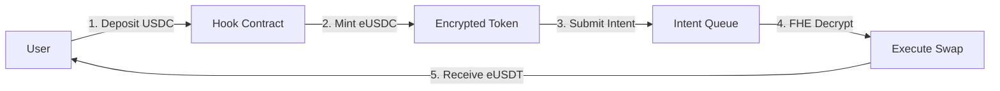

# Universal Privacy Hook for Uniswap V4

`A privacy-preserving hook implementation for Uniswap V4 that enables confidential swaps using Fully Homomorphic Encryption (FHE)`

## 🌟 Overview

The Universal Privacy Hook transforms any Uniswap V4 pool into a privacy-preserving DEX where swap amounts remain completely confidential. Using cutting-edge FHE technology from Fhenix, traders can:

- **Deposit** regular tokens to receive encrypted token representations
- **Submit** encrypted swap intents without revealing amounts
- **Execute** swaps privately with zero front-running risk
- **Withdraw** tokens while maintaining complete privacy

## 🚀 Key Features

### 🔐 **Complete Privacy**
- Swap amounts encrypted end-to-end using FHE
- No MEV or front-running possible
- Privacy maintained across all operations

### 🌐 **Universal Multi-Pool Support**
- Single hook serves unlimited pools
- Automatic encrypted token creation per pool
- Independent reserve tracking for each pool

### ⚡ **Seamless Integration**
- Works with any ERC20 token pair
- No modifications to Uniswap V4 core
- Compatible with existing infrastructure

## 🏗️ Architecture



### User Flow Example
1. Alice deposits 1000 USDC → receives 1000 encrypted eUSDC
2. Alice submits encrypted swap intent: 200 eUSDC → eUSDT
3. FHE decryption occurs asynchronously
4. Hook executes swap when decrypted
5. Alice receives encrypted eUSDT tokens

## 📁 Project Structure

```
src/
├── Queue.sol                        # FIFO queue for encrypted intents
└── privacy/
    ├── UniversalPrivacyHook.sol    # Main hook implementation
    ├── HybridFHERC20.sol           # Hybrid encrypted/public token
    └── interfaces/
        └── IFHERC20.sol            # FHE token interface

test/
├── UniversalPrivacyHook.t.sol     # Comprehensive test suite
└── utils/                          # Testing utilities

script/                             # Deployment scripts (testnet ready)

privateSwap/                        # Future development docs
├── Plan.md                        # AVS integration roadmap
├── TDD.md                         # Test-driven development specs
└── core.md                        # Core protocol design
```

## 🛠️ Installation

### Prerequisites
- [Foundry](https://book.getfoundry.sh) (forge, cast, anvil)
- [Node.js](https://nodejs.org/) >= 18
- [pnpm](https://pnpm.io/) or npm


## 🧪 Testing

The test suite demonstrates all key functionality with FHE mock contracts:

```bash
# Run all tests
forge test

# Run with detailed output
forge test -vvv

# Run specific test
forge test --match-test testCompletePrivacyFlow

# Run with gas reporting
forge test --gas-report
```

### Test Coverage
| Test | Description | Status |
|------|-------------|--------|
| `testPoolCreation` | Verify pool initialization with hook | ✅ |
| `testUserDeposit` | Test token deposit and encrypted minting | ✅ |
| `testEncryptedIntentSubmission` | Submit encrypted swap intents | ✅ |
| `testCompletePrivacyFlow` | End-to-end privacy flow | ✅ |
| `testMultiPoolSupport` | Multi-pool with independent tokens | ✅ |

## 🚀 Deployment

### Local Development (Anvil)
```bash
# Start local blockchain
anvil

# Deploy contracts (in new terminal)
forge script script/Anvil.s.sol \
    --rpc-url http://localhost:8545 \
    --private-key 0xac0974bec39a17e36ba4a6b4d238ff944bacb478cbed5efcae784d7bf4f2ff80 \
    --broadcast
```

### Testnet Deployment
*Coming soon - deployment scripts are testnet-ready*

## 💡 Key Concepts

### Encrypted Tokens (eTokens)
Each pool automatically creates encrypted versions of its tokens:
- **1:1 Backing**: Every eToken is backed by real tokens in the hook
- **Privacy**: Balances and transfers are encrypted using FHE
- **Composability**: eTokens can be transferred between users privately

### Intent Queue System
Orders are processed through a FIFO queue:
1. User submits encrypted intent
2. FHE decryption requested
3. Intent executed when decrypted
4. User receives output tokens

### Trivial Encryption
The hook uses "trivial encryption" for deposits:
```solidity
euint128 encrypted = FHE.asEuint128(plainAmount);
```
This allows converting plaintext amounts to encrypted format on-chain.

## 🔮 Future Development

The `privateSwap/` folder contains planning documents for advanced features:

- **AVS Integration**: Decentralized decryption network
- **Advanced Orders**: Limit orders, stop losses, TWAPs
- **Cross-chain Privacy**: Bridge encrypted tokens across chains
- **MEV Protection**: Additional layers of protection
- **Governance**: Decentralized hook parameter management

## ⚙️ Configuration

### Compiler Settings
```toml
# foundry.toml
[profile.default]
solc_version = "0.8.26"
evm_version = "cancun"
via_ir = true          # Required for stack optimization
optimizer = true
optimizer_runs = 200
```

## 🔒 Security Considerations

- **Token Custody**: All deposited tokens held by hook with 1:1 backing
- **FHE Security**: Amounts remain encrypted until execution
- **Reentrancy Protection**: All state-changing functions protected
- **Access Control**: Only pool manager can call hook functions
- **Audits**: *Pending - use at your own risk on mainnet*

## 📚 Dependencies

- [Uniswap V4 Core](https://github.com/Uniswap/v4-core) - DEX protocol
- [Fhenix CoFHE](https://github.com/FhenixProtocol/fhenix-contracts) - FHE implementation
- [OpenZeppelin](https://github.com/OpenZeppelin/openzeppelin-contracts) - Security utilities
- [Forge STD](https://github.com/foundry-rs/forge-std) - Testing framework

## 📖 Resources

### Documentation
- [Uniswap V4 Docs](https://docs.uniswap.org/contracts/v4/overview)
- [Fhenix CoFHE Docs](https://cofhe-docs.fhenix.zone/docs/devdocs/overview)
- [Hook Development Guide](https://v4-by-example.org)

### References
- [FHE Limit Order Hook](https://github.com/marronjo/iceberg-cofhe) - Inspiration
- [V4 Hook Examples](https://github.com/Uniswap/v4-periphery/tree/example-contracts/contracts/hooks/examples)

## 🤝 Contributing

Contributions are welcome! Please:
1. Fork the repository
2. Create a feature branch
3. Add tests for new functionality
4. Submit a pull request

## 📝 License

MIT

## ⚠️ Disclaimer

This is experimental software using cutting-edge cryptography. Use at your own risk. Not audited for production use.

## 🙏 Acknowledgments

Built with inspiration from:
- Uniswap V4 team for the hooks architecture
- Fhenix team for FHE infrastructure
- MarketOrder reference implementation for queue concepts

---